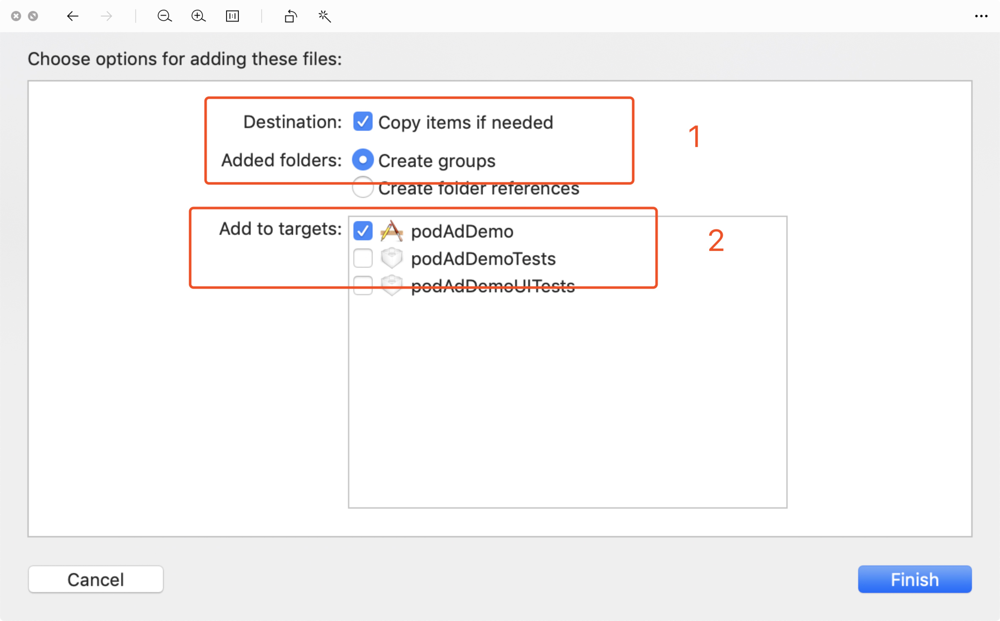
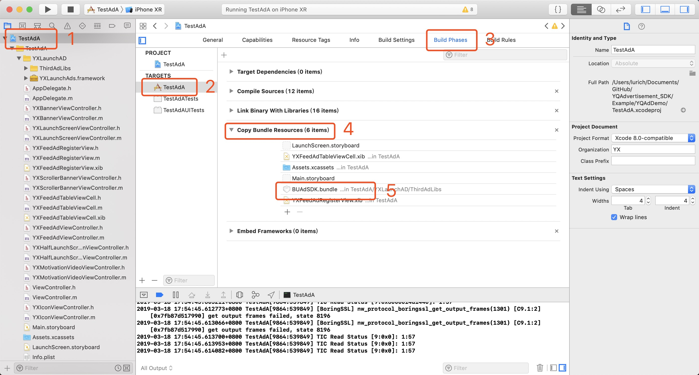
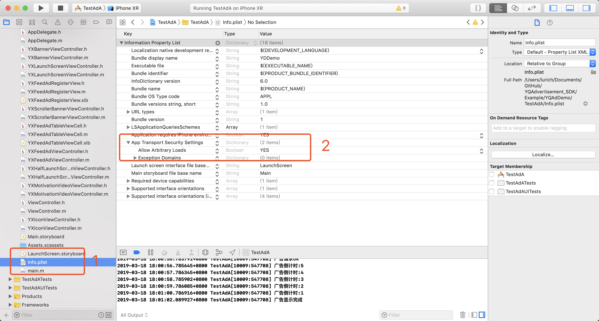
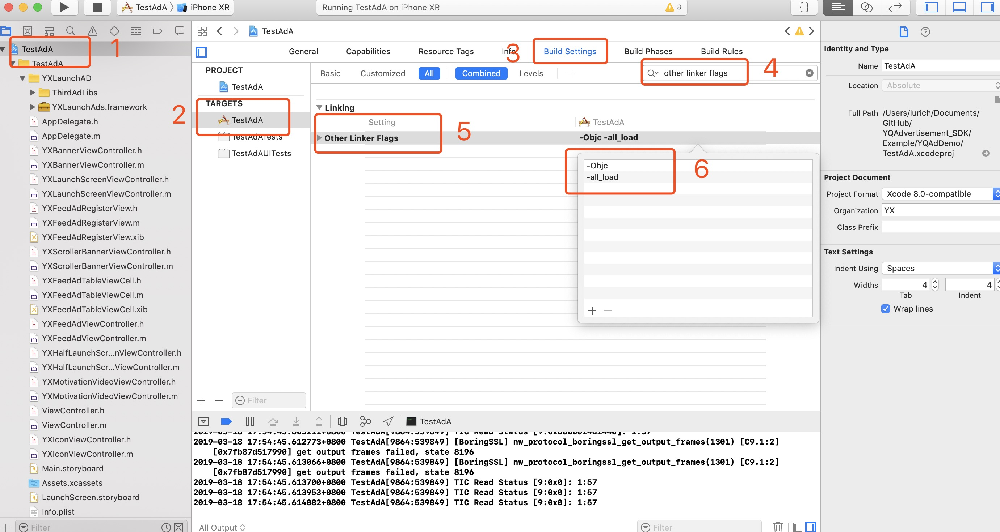
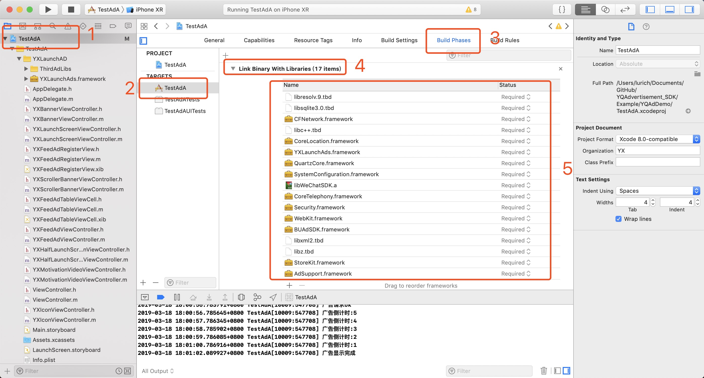

# 云蜻广告 iOS SDK 接入说明

| 文档版本| 修订日期| 修订说明|
| --- | --- | --- |
| v1.0 | 2018-3-23 | 创建文档，支持Banner，信息流广告|
| v1.1 | 2018-5-21 | 增加超时处理，超过30秒钟后会返回失败。|
| v2.0 | 2018-6-30 | 增加广告位icon|
| v2.1 | 2018-7-17 | 增加广告渠道，SDK中配置开屏显示逻辑|
| v2.2 | 2018-8-28 | 优化超时请求处理.优化开屏展示逻辑   |
| v2.3 | 2018-9-2 | 增加广告内容，优化展示|
| v2.4 | 2018-9-25 | 【1】请求超时时间默认5秒 【2】去掉showEnterForeground 属性，此属性不再使用【3】demo中附带 icon 请求示例，启动页再次请求示例 【4】所有的广告windows不再使用keywindow 【5】第三方framework更新 |
| v2.5 | 2018-10-04 |【1】增加banner广告 【2】优化开屏广告 |
| v2.8 | 2018-11-10 |【1】增加广告点击跳转微信小程序功能。【2】微信开放平台新增了微信模块用户统计功能 【3】增加原生广告。 |
| v2.9  | 2018-12-16 |【1】优化轮播banner展示【2】添加pageController，默认显示 |
| v3.0 | 2019-02-19 |【1】增加更多尺寸的banner显示 【2】增加自定义大小的原生尺寸广告数据  |
| v3.0.3 | 2019-03-19 | 增加多Icon样式。 |
| v4.0.0 | 2019-04-12 |  【1】优化轮播广告展示，增强用户自定义体验  【2】增加数据安全性。 |
| v4.0.1 | 2019-04-15 |  修复 BUG |
| v4.0.2 | 2019-04-16 |  更新 SDK 的轮播控件，增加自定义属性 |
| v4.1.0 | 2019-04-16 |  修复 轮播图不能点击的 BUG |
| v4.1.1 | 2019-04-16 |  更新 Demo 稳定对接版本 |
| v4.1.2 | 2019-04-16 |  修复一个隐藏 bug |
<!-- TOC -->

- [云蜻广告 iOS SDK 接入说明](#云蜻广告-ios-sdk-接入说明)
    - [1. iOS SDK接入](#1-ios-sdk接入)
        - [1.1 申请应用的媒体位ID](#11-申请应用的媒体位ID)
        - [1.2 iOS SDK导入framework](#12-iOS_SDK导入framework)
           - [准备工作](#准备工作)
           - [方法一：直接拖入动态库](#方法一直接拖入动态库)
               - [1.2.1 工程设置导入framework](#121-工程设置导入framework)
               - [1.2.2 Xcode编译选项设置](#122-xcode编译选项设置)
                  - [1.2.2.1 添加权限](#1221-添加权限)
                  - [1.2.2.2 运行环境配置](#1222-运行环境配置)
                  - [1.2.2.3 添加依赖库](#1223-添加依赖库)
           - [方法二：使用CocoaPods](#方法二使用CocoaPods)
    - [2. SDK接口类介绍与广告接入](#2-sdk接口类介绍与广告接入)
        - [2.1 全局设置](#21-全局设置)
        - [2.2 原生广告](#22-原生广告)
        - [2.3 Icon广告](#23-Icon广告)
        - [2.4 原生banner广告](#24-原生banner广告)
        - [2.5 原生轮播广告](#25-原生轮播广告)
        - [2.6 原生插屏广告](#26-原生插屏广告)
        - [2.7 开屏广告](#27-开屏广告)
        - [2.8 激励视频](#28-激励视频)

    - [附录](#附录)
        - [SDK错误码](#错误码)
        - [FAQ](#faq)

<!-- /TOC -->


## 1. iOS SDK接入

#### 准备工作

### 1.1 申请应用的媒体位ID
1.   申请账号：开发者从云蜻SDK后台运营人员处获取账号、密码后，登录[云蜻SDK系统后台](http://sspview.yunqingugm.com/)。

2.   媒体位id：开发者每创建一个应用后，系统会自动生成媒体位id，可在云蜻SDK后台界面查看到已创建的应用以及对应的媒体位id。

### 1.2 iOS_SDK导入framework

#### 方法一：直接拖入动态库

#### 1.2.1 工程设置导入framework

获取 framework 文件后直接将 {YXLaunchAD}文件拖入工程即可。

拖入时请按以下方式选择：



拖入完请确保Copy Bundle Resources中有BUAdSDK.bundle，否则可能出现icon图片加载不出来的情况。



#### 1.2.2 Xcode编译选项设置

#### 1.2.2.1 添加权限

 **注意要添加的系统库**

+ 工程plist文件设置，点击右边的information Property List后边的 "+" 展开

添加 App Transport Security Settings，先点击左侧展开箭头，再点右侧加号，Allow Arbitrary Loads 选项自动加入，修改值为 YES。 SDK API 已经全部支持HTTPS，但是广告主素材存在非HTTPS情况。

```json
<key>NSAppTransportSecurity</key>
    <dict>
         <key>NSAllowsArbitraryLoads</key>
         <true/>
    </dict>
```
具体操作如图：



+ Build Settings中Other Linker Flags **增加参数-ObjC**，SDK同时支持-all_load

具体操作如图：



#### 1.2.2.2 运行环境配置

+ 支持系统 iOS 8.X 及以上;
+ SDK编译环境 Xcode 9.0;
+ 支持架构：i386, x86-64, armv7, armv7s, arm64
+ 本SDK依赖微信库，集成可参考[微信SDK集成](https://open.weixin.qq.com/cgi-bin/showdocument?action=dir_list&t=resource/res_list&verify=1&id=1417694084&token=88534ffbd0c33679ceca8232a91cfeae92585126&lang=zh_CN)

#### 1.2.2.3 添加依赖库
工程需要在TARGETS -> Build Phases中找到Link Binary With Libraries，点击“+”，依次添加下列依赖库	

+ StoreKit.framework
+ MobileCoreServices.framework
+ WebKit.framework
+ MediaPlayer.framework
+ CoreMedia.framework
+ AVFoundation.framework
+ CoreLocation.framework
+ CoreTelephony.framework
+ SystemConfiguration.framework
+ AdSupport.framework
+ CoreMotion.framework
+ libresolv.9.tbd
+ libc++.tbd
+ libz.tbd
+ libxml2.tbd 
+ Security.framework  
+ QuartzCore.framework 
+ CoreGraphics.framework
+ UIKit.framework
+ Foundation.framework 


具体操作如图所示：



#### 方法二：使用CocoaPods

SDK3.0版本以后支持pod方式接入，只需配置pod环境，在podfile文件中加入以下代码即可接入成功。不用在添加任何依赖库。
```
# 建议pod到最新版本 当前最新版本为4.1.2
pod 'YXLaunchAD' , '~> 4.1.2'
```
更多关于pod方式的接入请参考 [gitthub地址](https://github.com/xiaofu666/YQAdvertisement_SDK)

## 2. SDK接口类介绍与广告接入

### 2.1 全局设置

#### 2.1.1 使用

SDK的开屏广告建议在 AppDelegate 的方法 ```- (BOOL)application:(UIApplication *)application didFinishLaunchingWithOptions:(NSDictionary *)launchOptions``` 里最先进行初始化

### 2.2 原生广告
+ **类型说明：** 广告原生广告即一般广告样式，形式分为图文和视频，按场景又可区分为原生banner、原生插屏广告等。

+ **使用说明：** 在SDK里只需要使用 YXFeedAdManager 就可以获取原生广告，YXFeedAdManager 类提供了原生广告的数据类型等各种信息，在数据获取后可以在属性 data（YXFeedAdData）里面获取广告数据信息。

### 2.3 Icon广告

+ **类型说明：**Icon广告主要是 APP 中展示一个小图标，用户点击可跳到对应的广告业或者小程序。
+ **使用说明：**SDK可提供单Icon与多Icon样式。具体可参考Demo中YXIconViewController部分示例代码。

1. 导入

```objective-c
#import <YXLaunchAds/YXIconAdManager.h>
```


2. 遵循代理  

```objective-c
<YXIconAdManagerDelegate>
```


3. 使用示例

```objective-c
self.iconAd = [[YXIconAdManager alloc]initWithFrame:CGRectMake(100, 300, 40, 40)];
self.iconAd.mediaId = iconMediaID;
self.iconAd.adType = YXIconType;
self.iconAd.delegate = self;
[self.iconAd loadIconAd];
```


### 2.4 原生banner广告
+ **类型说明：**原生banner广告是为满足媒体多元化需求而开发的一种原生广告。
+ **使用说明：**SDK可提供数据绑定、点击事件的上报、响应回调，开发者进行自渲染，接入方式同原生广告相同。具体可参考Demo中YXBannerViewController部分示例代码

### 2.5 原生轮播广告

+ **类型说明：**原生轮播广告主要是在APP 中展示的广告轮播视图，开发只要按照接入标准就能够展示设计好的视图。具体可参考Demo中YXScrollerBannerViewController部分示例代码

### 2.6 原生插屏广告
+ **类型说明：**原生插屏广告是为满足媒体多元化需求而开发的一种原生广告。
+  **使用说明：**SDK可提供数据绑定、点击事件的上报、响应回调，开发者进行自渲染，接入方式同原生广告相同。具体可参考Demo中YXInterstitialViewController部分示例代码

### 2.7 开屏广告

+ **类型说明：**开屏广告主要是 APP 启动时展示的全屏广告视图，开发只要按照接入标准就能够展示设计好的视图。具体可参考Demo中YXInterstitialViewController部分示例代码

1. 导入

```objective-c
#import <YXLaunchAds/YXLaunchAdManager.h>
```


2. 遵循代理 

```objective-c
<YXLaunchAdManagerDelegate>
```


3. 广告页面呈现在一个不是keywindow的windows上 ，建议开屏广告的初始化放在第一位。

* 非全屏示例：
​    
```objective-c
​    YXLaunchAdManager *adManager = [YXLaunchAdManager shareManager];
​    
​    adManager.waitDataDuration = 5;
​    adManager.duration = 5;
​    adManager.frame = CGRectMake(0, 0, [UIScreen mainScreen].bounds.size.width, [UIScreen adManager.mediaId = splashMediaID;
​    adManager.adType = YXScreenType; 
​    adManager.imageOption = YXLaunchAdImageDefault;
​    adManager.contentMode = UIViewContentModeScaleAspectFill;
​    adManager.showFinishAnimate = ShowFinishAnimateNone;
​    adManager.showFinishAnimateTime = 0.8;
​    adManager.skipButtonType = SkipTypeTimeText;
​    adManager.delegate = self;
​    
​    UIView *bottom = [[UIView alloc]initWithFrame:CGRectMake(0, [UIScreen mainScreen].bounds.size.height * 0.8, [UIScreen mainScreen].bounds.size.width, [UIScreen mainScreen].bounds.size.height * 0.2)];
​    bottom.backgroundColor = [UIColor clearColor];
​    UIImageView *logoImageView = [[UIImageView alloc]initWithImage:[UIImage imageNamed:@"yxadlogo"]];
​    //把logo置于 bottom 中心
​    logoImageView.frame = bottom.bounds;
​    logoImageView.contentMode =  UIViewContentModeCenter;
​    [bottom addSubview:logoImageView];
​    
​    adManager.bottomView = bottom;
​    [adManager loadLaunchAdWithShowAdWindow:self.window];
```
​    
​    建议等待时间设置为5秒，展示时间设置为5秒。
​    App在从后台5分钟后到前台时 建议也加上开屏广告。

### 2.8 激励视频

+ **类型说明：**激励视频广告是一种全新的广告形式，用户可选择观看视频广告以换取有价物，例如虚拟货币、应用内物品和独家内容等等；这类广告的长度为 15-30 秒，不可跳过，且广告的结束画面会显示结束页面，引导用户进行后续动作。具体可参考Demo中YXMotivationVideoViewController部分示例代码。

1. 导入

```objective-c
#import <YXLaunchAds/YXMotivationVideoManager.h>  
```

2. 遵循代理 

```objective-c
<YXMotivationDelegate>
```


3. 使用示例

```objective-c
self.motivationVideo = [YXMotivationVideoManager new];
self.motivationVideo.delegate = self;
self.motivationVideo.showAdController = self;
self.motivationVideo.isVertical = YES;
self.motivationVideo.mediaId = @"beta_ios_video";
```


## 附录

### 错误码
下面是各种ErrorCode的值

```Objective-C
    ErrorCode       = -3,     // 解析的数据没有广告
    ErrorCode       = -2,     // 网络请求失败
    ErrorCode       = -1,     // 解析失败
    ErrorCode       = 10001,  // 参数错误
    ErrorCode       = 10002,
    ErrorCode       = 20000,
    ErrorCode       = 20001,  // 没有广告
    ErrorCode       = 40000,  // http conent_type错误
    ErrorCode       = 40001,  // http request pb错误
    ErrorCode       = 40002,  // 请求app不能为空
    ErrorCode       = 40003,  // 请求wap不能为空
    ErrorCode       = 40004,  // 缺少广告位描述
    ErrorCode       = 40005,  // 广告位尺寸 不合法
    ErrorCode       = 40006,  // 广告位 ID 不合法
    ErrorCode       = 40007,  // 请求广告数量 错误
    ErrorCode       = 50001   // 广告服务器错误
    服务器错误码
    ErrorCode       = 40008 //没有填写素材尺寸，或者素材尺寸大于 10000
    ErrorCode       = 40009 //媒体是空，或者没有运行
    ErrorCode       = 40015 //媒体已经被通知整改三次以上,进行校验,如果字段非法,则不返回广告
    ErrorCode       = 40016 //请求的 appid 与媒体平台的 appid 不一致 
    ErrorCode       = 40018 //SDK包名与广告配置包名不一致
    
    ErrorCode       = 205001 //后台数据错误
    ErrorCode       = 205002 //视频素材下载错误
    ErrorCode       = 205003 //视频素材播放错误
    ErrorCode       = 205004 //没匹配的广告，禁止重试，否则影响流量变现效果
    ErrorCode       = 205005 //广告请求量或者消耗等超过日限额，请第二天再请求广告
    ErrorCode       = 205006 //包名校验非法
    ErrorCode       = 205009 //广告请求量或者消耗等超过小时限额，请一小时后再请求广告
    ErrorCode       = 205010 //广告样式校验失败，请检查广告位与接口使用是否一致
    ErrorCode       = 205012 //广告过期，请重新拉取
    ErrorCode       = 205013 //广告拉取过于频繁，请稍后再试
    ErrorCode       = 206000 //未知错误，联系腾讯广告联盟商务同事协助排查
    
```


### FAQ

1. 媒体平台配置了只出小图和组图，为什么会返回大图？（类似返回素材类型和媒体平台不符问题）

	答：先check下接入版本，1.1及之前版本的SDK对素材类型解析有问题，如果版本问题建议升级；

2. iOS的广告页面在我们app内打开，没有办法关闭或返回。

	答：无法返回是由于 您的主页ViewController 隐藏了NavigationBar；

3.	发现 SDK里 UIWebView 类有内存泄漏。

	答：是系统的问题， UIWebView 一直有泄漏， 我们后续会考虑用 WKWebView 替换

4. iOS集成的包大小是多少?

	答	: 根据我们demo打包后的计算为1M左右. 但是具体大小会根据导入的功能有所差别. 实际情况以集成后的包大小为主.
			
